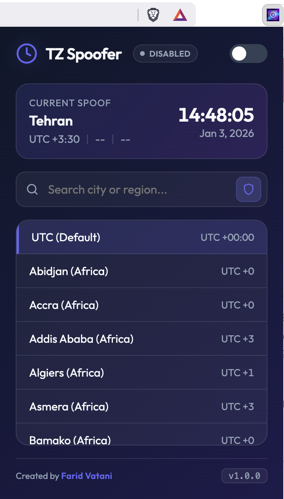
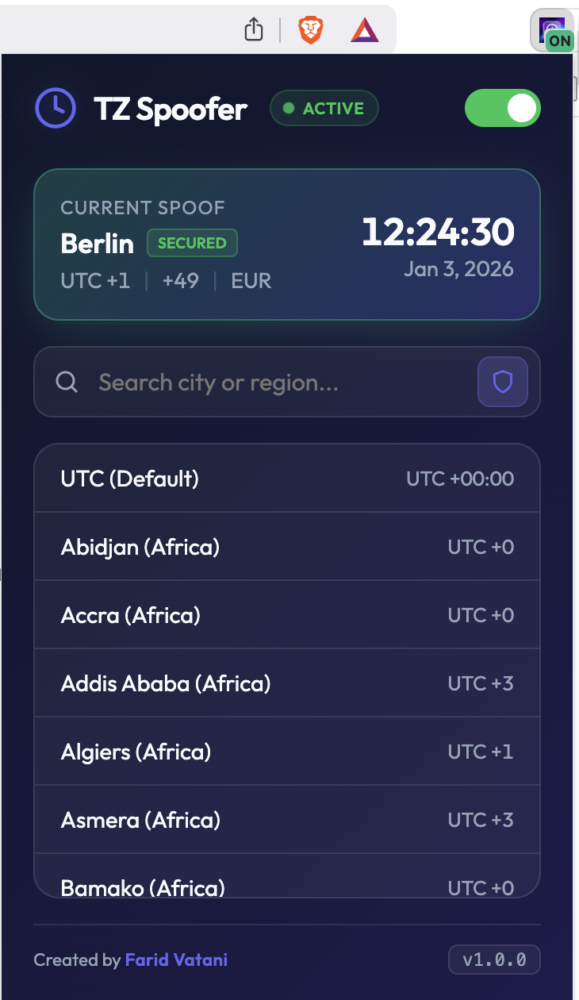

# Timezone Spoofer (Bulletproof Edition)

|                       Extension Disabled                       |                     Extension Activated                      |
| :------------------------------------------------------------: | :----------------------------------------------------------: |
|  |  |

A powerful, stealthy Chrome extension that protects your privacy by spoofing timezone-related APIs and masking your hardware fingerprint. Unlike basic spoofers, this extension provides comprehensive protection against advanced browser fingerprinting techniques.

## 🎯 What It Does

Timezone Spoofer goes beyond simple clock manipulation—it creates a complete, consistent digital identity by synchronizing your timezone, locale, currency, and even intercepting network calls to geolocation APIs. It also masks your hardware signature to prevent identification through platform and vendor information.

## ✨ Key Features

### 🔒 Advanced Spoofing Technology

- **Bulletproof API Overrides**: Deeply patches `Date` and `Intl` (Internationalization) objects to ensure consistency across all JavaScript calls, preventing detection by fingerprinting scripts
- **Worker & SharedWorker Support**: Injects spoofing logic into `Worker` and `SharedWorker` contexts using secure Blob-wrapping, preventing timezone leaks via background threads
- **Network Interception**: Automatically intercepts and spoofs response data from popular IP-Geolocation APIs (e.g., `ipapi.co`, `ip-api.com`, `ipinfo.io`, `ipgeolocation.io`) to match your selected timezone
- **Locale & Currency Sync**: Automatically updates `navigator.languages`, `Intl.NumberFormat` (currency/formatting), and `Intl.DateTimeFormat` to match the target country's standards
- **Stealth Mode**: Implements native-style function wrapping (`toString`, `name`, `length`) to remain undetected by anti-spoofing scripts (e.g., Cloudflare, FingerprintJS)
- **CSP Bypass**: Dynamically modifies Content Security Policies (CSP) to permit the execution of spoofing scripts on highly secure websites

### 🛡️ Hardware Masking

- **Platform Masking**: Hides your real operating system (Mac/Linux/etc.) and reports "Win32" (the most common platform)
- **Vendor Masking**: Masks identifying browser vendor information
- **Touch Points**: Hides whether you have a touch screen to prevent device type detection
- **Secured Badge**: Visual indicator showing when hardware masking is active

### 🎨 User-Friendly Interface

- **Modern Dark Theme**: Beautiful, intuitive interface with smooth animations
- **Real-Time Preview**: Live clock and date display showing your selected timezone
- **Smart Search**: Quick search functionality to find timezones by city or region name
- **IP Sync Button**: One-click synchronization with your current IP location's timezone
- **Visual Feedback**:
  - Status indicators (Active/Disabled)
  - Success/error notifications
  - Auto-hiding refresh reminders
- **Metadata Display**: Shows calling code, currency, and timezone offset for selected location
- **Persistent Settings**: Remembers your preferences across browser sessions

## 📦 Installation

Since this is a developer version, follow these steps to install it manually:

1. **Clone or Download** this repository to your local machine
2. Open Chrome and navigate to `chrome://extensions`
3. Enable **Developer mode** (toggle in the top-right corner)
4. Click **Load unpacked**
5. Select the project folder (the one containing `manifest.json`)
6. The **Timezone Spoofer** icon should now appear in your extension toolbar

## 🚀 Quick Start Guide

### Basic Usage

1. **Open the Extension**: Click the Timezone Spoofer icon in your Chrome toolbar
2. **Enable Spoofing**: Toggle the switch at the top-right to activate the extension
3. **Select a Timezone**:
   - Use the search bar to find a city or region
   - Click on any timezone from the list
   - Or use the IP Sync button (shield icon) to automatically detect and sync with your current IP location
4. **Refresh Pages**: The extension will remind you to refresh open tabs for changes to take effect

### Understanding the Interface

- **Status Indicator**: Shows "Active" (green) when spoofing is enabled, "Disabled" (gray) when off
- **Preview Card**: Displays the selected timezone name, offset, calling code, currency, and a live clock
- **Secured Badge**: Appears when the extension is active, indicating that hardware masking is protecting your identity
- **IP Sync Button**: Shield icon in the search bar - click to automatically sync with your IP's timezone
- **Refresh Banner**: Appears when you make changes, automatically disappears after 3 seconds

### Advanced Features

- **Hardware Masking**: Automatically active when the extension is enabled - no additional configuration needed
- **Network Spoofing**: Automatically intercepts geolocation API calls - works transparently in the background
- **Worker Thread Protection**: Automatically protects Web Workers and Shared Workers - no setup required

## 🛠️ How It Works

### Technical Overview

1. **Context Injection**: The extension injects a high-priority script (`injectedSpoof.js`) into every page at `document_start`, before any other scripts can detect your real timezone
2. **API Shadowing**: Global constructors like `Date` and `Intl.DateTimeFormat` are replaced with proxies that calculate time based on your selected timezone instead of the system clock
3. **Cross-Thread Security**: By overriding the `Worker` constructor, the extension ensures that any code running in a sandbox or worker thread receives the same spoofed environment
4. **Header Modification**: Uses `declarativeNetRequest` to modify CSP headers, allowing the `blob:` URLs required for Worker spoofing to function correctly
5. **Network Interception**: Intercepts `fetch()` and `XMLHttpRequest` calls to geolocation APIs, returning spoofed data that matches your selected timezone

### Protection Layers

- **Layer 1**: Date/Time API spoofing (Date, Intl.DateTimeFormat)
- **Layer 2**: Locale and currency synchronization
- **Layer 3**: Worker thread protection
- **Layer 4**: Network API interception
- **Layer 5**: Hardware signature masking

## 🧪 Testing Your Protection

You can verify the effectiveness of the spoofing on these platforms:

- **[ExposedByDefault](https://neberej.github.io/exposedbydefault/)** - Checks for Worker leaks and advanced fingerprinting
- **[Browserleaks](https://browserleaks.com/ip)** - Checks Geolocation APIs and IP-based detection
- **[Fingerprint.com](https://fingerprint.com/products/bot-detection/)** - Advanced bot/spoof detection testing
- **[Whoer](https://whoer.net/)** - Comprehensive privacy and fingerprinting analysis

## ⚙️ Configuration

### Settings Persistence

All your settings are automatically saved:

- Enabled/Disabled state
- Selected timezone
- Metadata (calling code, currency, locale)

### Manual Configuration

If you need to reset your settings:

1. Open Chrome DevTools (F12)
2. Go to Application → Storage → Local Storage
3. Clear the extension's storage data

## 🔍 Troubleshooting

### Extension Not Working?

1. **Check if it's enabled**: Look for the green "Active" status in the popup
2. **Refresh your tabs**: Changes require a page refresh to take effect
3. **Check the console**: Open DevTools (F12) and look for any error messages
4. **Verify permissions**: Ensure the extension has all required permissions

### Spoofing Not Detected?

1. **Hard refresh**: Try Ctrl+Shift+R (or Cmd+Shift+R on Mac) to clear cache
2. **Test on multiple sites**: Some sites cache timezone data
3. **Check Worker support**: Test on ExposedByDefault to verify Worker protection

## 📝 Technical Details

### Supported APIs

- `Date` object and all its methods
- `Intl.DateTimeFormat`
- `Intl.NumberFormat` (currency formatting)
- `Intl.Locale`
- `navigator.language` and `navigator.languages`
- `Worker` and `SharedWorker` constructors
- `fetch()` and `XMLHttpRequest` (for geolocation APIs)

### Intercepted Geolocation APIs

The extension automatically intercepts requests to:

- ipapi.co
- ip-api.com
- freegeoip.app
- ipgeolocation.io
- extreme-ip-lookup.com
- ipstack.com
- ipinfo.io
- ip-api.io
- ipwhois.io
- ipapi.com
- whatismyipaddress.com
- iplocation.net

## 🎯 Use Cases

- **Privacy Protection**: Prevent websites from tracking your real location through timezone fingerprinting
- **Testing & Development**: Test how your applications behave in different timezones
- **Research**: Study browser fingerprinting techniques and countermeasures
- **Access Control**: Bypass timezone-based restrictions on websites

## ⚠️ Important Notes

- **Page Refresh Required**: After enabling/disabling or changing timezones, you must refresh open tabs for changes to take effect
- **Extension Icon Badge**: The extension shows "ON" badge when active
- **Performance**: Minimal performance impact - spoofing is highly optimized with caching
- **Compatibility**: Works on all websites, including those with strict CSP policies

## 🤝 Contributing

This is a developer version. Contributions, bug reports, and feature requests are welcome!

## 📄 License

This project is intended for privacy research and development purposes. Please use responsibly and in accordance with applicable laws and terms of service.

## 👤 Author

Created by [**Farid Vatani**](https://github.com/faridvatani)

- 🌐 [GitHub](https://github.com/faridvatani)
- 🐦 [X (Twitter)](https://x.com/faridvatani)
- 💼 [Website](https://faridvatani.com)

---

_Disclaimer: This tool is intended for privacy research, development, and educational purposes. Users are responsible for ensuring their use complies with applicable laws and website terms of service. The developers are not responsible for any misuse of this software._
